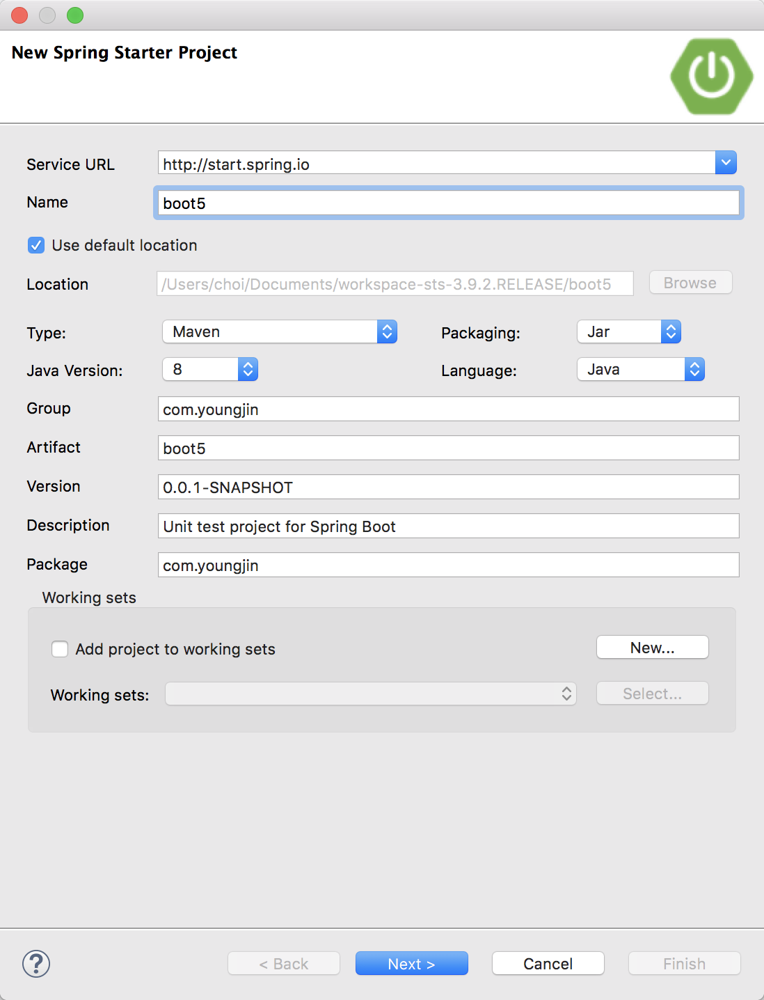

# Ch.5(2018.04.30)
## Index
1. Thymeleaf
2. etc
3. 시험회고
## 1.Thymeleaf

Thymeleaf: java 라이브러리로 xml, xhtml, html5 문서를 생성하는 템플릿 엔진(광파는 애)
1. Spring Starter Project 생성

* 프로잭트 생성

#### 2.etc
~~~
Java script가 왜 맨밑에 내려가나?
1. 상향 호이스팅을 한다.
2. 속도가 30%정도 빨라진다.
3. 표준은 아니다.
~~~
##### 3.시험회고
~~~
-거의 모든 시험이 2차 면접 손코딩
-대소문자/들여쓰기 등의 Convention을 지켜라
-C클래스 구간 친구들 걸러내기
-배점위주로 풀어야한다
-Logic위주로 푼다
~~~